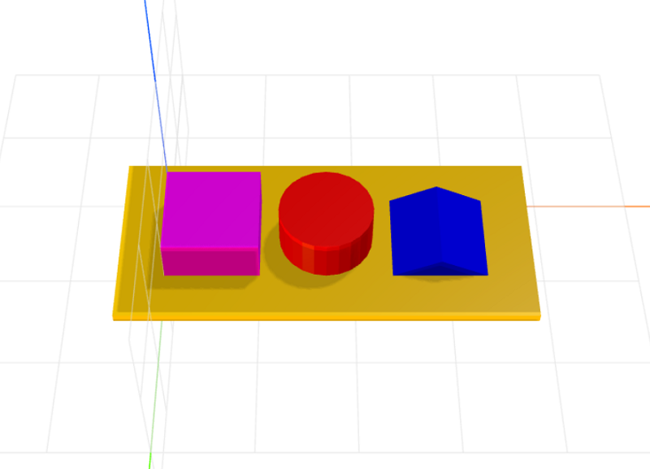

# craft-page
Page module for CraftML

### Usage
```html
<craft>
    <craft name="page" module="craft-page"/>
    <page></page>
</craft>
```

### Parameters
- xmargin: adjusts page margins on x-axis 
- ymargin: adjusts page margins on y-axis
- zmargin: adjusts page thickness

### Example
```html
<craft>
    <craft name="page" module="craft-page"/>
    <page>
        <row spacing="2" t="scale(1,1,0.5)">
            <cube></cube>
            <cylinder></cylinder>
            <prism></prism>
        </row>
    </page>
</craft>
```


